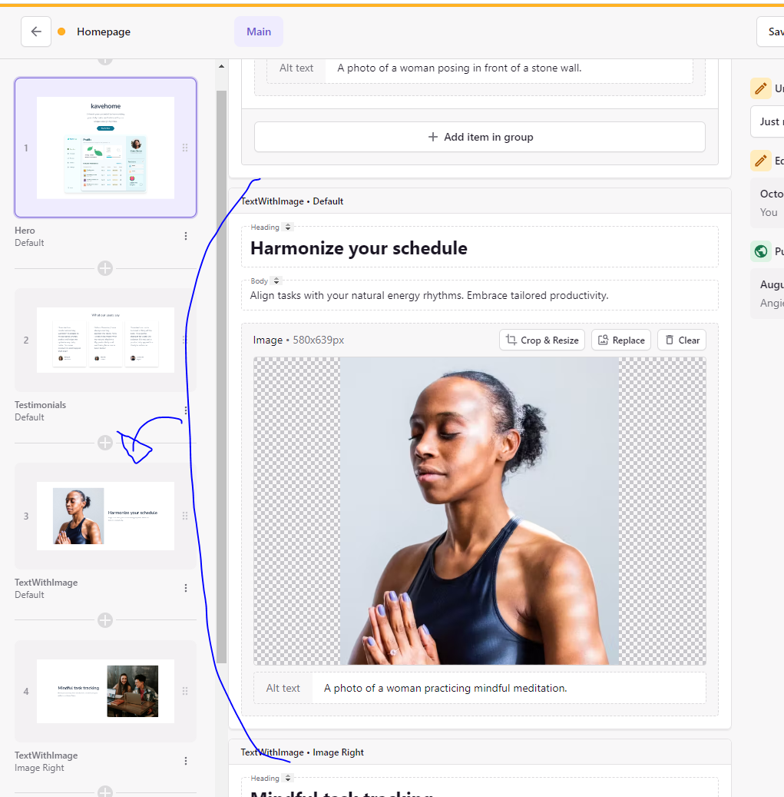

# CMS PoC

[Exemple](https://prismic.io/try/pages/YzNqdREAACIAnPeG?version=bb0c935a-9226-488f-9eed-d7d55982aa9c&id=hero%241dc39d8a-05f2-4f59-abc8-c337c3e3512e) de prismic de com acaba sent el page builder.

Construeixes la pàgina a partir de slices, cada eslice es una fila d'una sola columna, per tant per aquesta part esta una mica limitat, ja que no hi ha drag and drop, només tries l'ordre dels slices.

Es crea una carpeta slices on es guarden els diferents seccions de pagina (components) que es poden afegir a la pàgina anomenats slices.

Llavors aquest components si que poden importar components del design system o altres, a part has d'utilitzar els components de prismic per poder editar el contingut, per exemple ``PrismicRichText`` o ``PrismicNextImage``.

Al fer el ``yarn dev`` s'obren dos servidors, un per gestionar els slices, page types ... (http://localhost:9999/) un per la propia web de nextjs (aka nextjs de springfield) (http://localhost:3000/) aquestobre el http://localhost:3000/slice-simulator que serveis per conectar amb el servidor de prismic i veure com es veu la pàgina amb els slices.

Per editar les pagines i accedir al builder page s'ha de fer desde prismic.

Et donen un graphql per poder fer queries a prismic i obtenir el contingut de les pagines.

Docs: https://prismic.io/docs